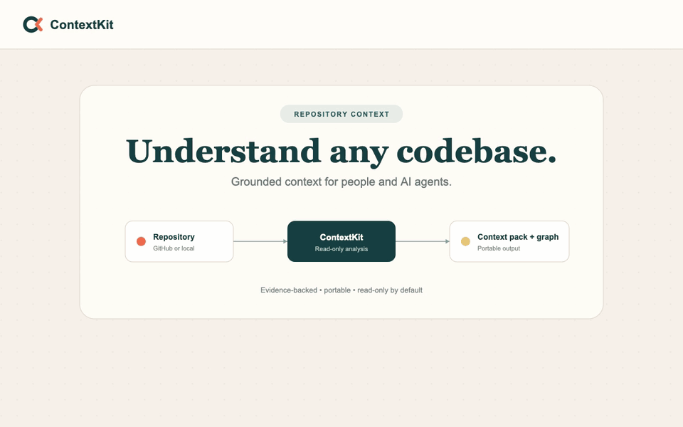
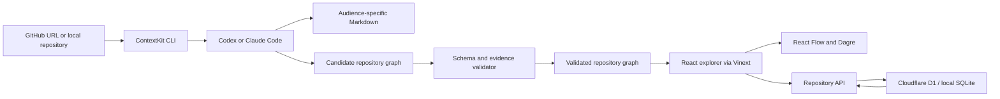

# ContextKit

Generate evidence-backed repository context packs and interactive architecture graphs for humans and AI agents.



## Why ContextKit?

Understanding an unfamiliar repository means piecing together information from source files, tests, configuration, scripts, CI workflows, and documentation. ContextKit turns that scattered knowledge into a structured context pack for onboarding, review, contribution, interview preparation, and AI-assisted development.

Unlike a generic repository summary, ContextKit produces audience-specific documents and a validated graph whose observed architecture claims cite repository-relative evidence paths.

## Architecture



The Bash CLI handles source resolution, temporary cloning, agent invocation, output selection, and file publishing. Codex or Claude Code inspects the target repository in read-only mode. Graphs are validated against the source repository before publication. The optional React explorer runs through Vinext, validates imported graph structure, stores documents through a Cloudflare D1 binding, and renders them with React Flow and Dagre.

## Quick Start

Requirements:

- Git and a Bash-compatible shell
- Codex CLI installed and authenticated, or Claude Code
- Node.js `>=22.13.0` for graph validation and the web interface

Install the CLI:

```bash
git clone https://github.com/nk-droid/contextkit.git
cd contextkit
make install
export PATH="$PWD/bin:$PATH"
```

Generate a complete context pack:

```bash
contextkit generate https://github.com/owner/repository --all --with-graph
```

By default, output goes to `./context-packs/<repo-slug>/` relative to the directory where you run the command.

Start the graph explorer:

```bash
make web-install
make web-dev
```

Open the local URL printed by the development server and import the generated `REPO_GRAPH.json` file.

## Example

Generate all documents and a repository graph with Codex:

```bash
contextkit generate https://github.com/owner/repository \
  --all \
  --with-graph
```

Use Claude Code with a larger turn budget:

```bash
contextkit generate /path/to/local/repository \
  --all \
  --with-graph \
  --agent claude \
  --max-turns 30
```

Choose a separate output directory:

```bash
contextkit generate /path/to/local/repository \
  --all \
  --with-graph \
  --output /path/to/output
```

Existing files are skipped by default. Add `--regenerate` to replace the selected outputs.

`--max-turns` applies only to Claude Code; `--model` can select a model for either agent.

## Generated Context

| Audience | Output | Focus |
|---|---|---|
| Human | `HUMAN_OVERVIEW.md` | Plain-English repository orientation |
| Architecture | `ARCHITECTURE.md` | Components, boundaries, flows, and trade-offs |
| Modules | `MODULE_GUIDE.md` | Important directories, files, and responsibilities |
| Reviewer | `REVIEWER_GUIDE.md` | Risk areas, checks, and validation strategy |
| Contributor | `CONTRIBUTOR_GUIDE.md` | Setup, reading order, and common workflows |
| Agent | `AGENT_CONTEXT.md` | Concise constraints and paths for AI systems |
| Interviewer | `INTERVIEWER_BRIEF.md` | Project narrative, decisions, and talking points |

A complete generation produces:

```text
context-packs/
  repo-slug/
    INDEX.md
    HUMAN_OVERVIEW.md
    ARCHITECTURE.md
    MODULE_GUIDE.md
    REVIEWER_GUIDE.md
    CONTRIBUTOR_GUIDE.md
    AGENT_CONTEXT.md
    INTERVIEWER_BRIEF.md
    REPO_GRAPH.json
```

Without `--all`, ContextKit generates the human overview by default. Select another audience with `--audience human`, `architecture`, `modules`, `reviewer`, `contributor`, `agent`, or `interviewer`.

## Repository Graph

`--with-graph` generates a portable `REPO_GRAPH.json` document conforming to the versioned contract in `schemas/repo-graph.schema.json`.

The generator requests an architecture view and adds runtime-flow, import, or deployment views when useful. Nodes and edges distinguish directly observed behavior from inferred relationships. Every observed graph element must include at least one valid repository-relative evidence path. Each view is limited to 300 nodes and 1,000 edges.

Validate a graph without opening the UI:

```bash
node scripts/validate-graph.mjs \
  path/to/REPO_GRAPH.json \
  /path/to/repository
```

The React explorer supports:

- multiple repositories and graph views
- searchable nodes and paths
- node-kind and edge-kind filters
- inferred-relationship toggles
- isolated-node filtering
- evidence inspection
- runtime-flow step controls
- automatic horizontal and vertical layouts
- JSON file and directory imports

Imported graph documents and repository metadata are persisted through a Cloudflare D1 `DB` binding. Local development uses a SQLite-backed D1 database under `web/.wrangler/state/`; hosted deployments use Cloudflare D1. Imports with the same repository ID replace the stored graph document. No repository is seeded.

## Safety Model

- ContextKit does not need to be installed inside the target repository.
- Public GitHub repositories are shallow-cloned into a temporary workspace.
- Local repositories are inspected in place by read-only agent tools.
- Agent tools are restricted to repository reading and searching.
- Generated context goes under the invoking directory by default; run from outside the target repository or use `--output` to keep it external.
- Graph output is written to a temporary file and validated before an atomic replacement.
- Invalid regeneration preserves the previous graph and saves rejected output as `.REPO_GRAPH.invalid-output.txt` in the output directory.
- The CLI validator rejects evidence paths that escape the repository or do not exist there.

Generated context is still a starting point for investigation, not a replacement for code review.

## Evaluation

ContextKit currently uses deterministic tests for the behavior it can verify automatically:

- schema conversion for Claude Code structured output
- successful graph generation and publication
- preservation of an existing graph after invalid regeneration
- surfaced agent error output
- structural graph validation
- unsafe and missing evidence-path rejection
- dangling-edge rejection
- observed-evidence enforcement
- duplicate-identifier rejection

Run the nine automated CLI and graph checks:

```bash
make graph-test
```

Validate the web application:

```bash
make web-build
```

Repository-scale evaluation should additionally record the pinned commit, source lines, tracked files, generation time, output size, graph nodes and edges, evidence references, unique evidence paths, and a manually audited evidence-accuracy sample. Performance numbers should only be published from repeatable measured runs.

## Architecture Decisions

- **Thin Bash orchestration:** keeps the CLI focused on source handling and agent execution rather than duplicating repository-analysis logic.
- **Audience-specific documents:** produces focused context instead of one long summary that serves every reader poorly.
- **External output:** avoids modifying repositories that a user only wants to understand.
- **Versioned graph contract:** keeps generated JSON portable and independent from the renderer.
- **Observed versus inferred relationships:** makes uncertainty visible instead of presenting every model conclusion as fact.
- **Evidence-required graph elements:** connects architectural claims to files that a reviewer can inspect.
- **Atomic graph generation:** prevents malformed model output from replacing the last valid artifact.
- **SQLite-compatible persistence:** uses local SQLite during development and Cloudflare D1 when hosted.
- **Computed layouts:** stores repository meaning rather than UI coordinates, allowing the frontend to change layout direction and spacing.

## Limitations

- Repository understanding depends on what the selected agent discovers within its inspection budget.
- Very large repositories may require narrower runs or a larger Claude Code turn limit.
- ContextKit does not currently record the exact files opened by the generation agent.
- Markdown claims are not yet represented as individually machine-verifiable evidence records.
- The MVP does not perform a separate static-analysis pass beyond agent inspection and graph validation.
- Generated context can become stale after the source repository changes.
- The web importer checks graph structure and safe path syntax, but cannot verify evidence-file existence without the source repository.
- The web interface has no application-level authentication and should not be exposed publicly with private graph data.
- Codex or Claude Code must be installed and authenticated separately.

## Roadmap

- Publish reproducible benchmarks across repository sizes and languages.
- Add revision-aware stale-context detection and incremental regeneration.
- Record inspection telemetry and claim-level evidence coverage.
- Add optimized profiles for major frameworks and monorepos.
